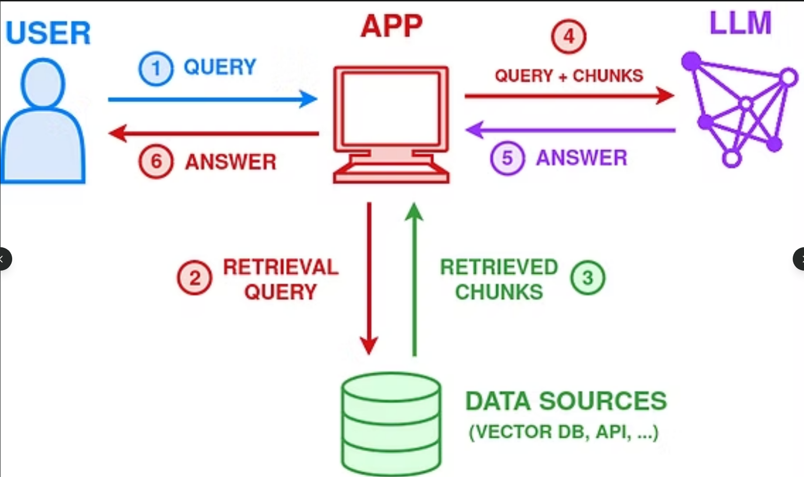

# Construction Chatbot Workshop
## Building a RAG Chatbot for Semiconductor Fab Construction



---

### 📋 Instructor Notes

**What we're building:** A simple chatbot that answers questions about semiconductor fabrication facility construction using RAG (Retrieval-Augmented Generation).

**How it works:**
1. We have a CSV file with construction FAQs (our knowledge base)
2. When a user asks a question, we search the CSV for relevant information
3. We send the relevant info + user question to the LLM (Llama via Ollama)
4. The LLM generates a helpful answer based on the retrieved context

**Time estimate:** ~90 minutes

**Prerequisites:**
- Ollama installed with Llama model (`ollama pull llama3.2`)
- Python 3.8+
- Antigravity coding agent access

remove windows restriction from virtual environment: 

```Set-ExecutionPolicy -ExecutionPolicy RemoteSigned -Scope CurrentUser```

---

### 📦 Requirements.txt

Before starting, create a file called `requirements.txt` with these contents:

```
streamlit
ollama
pandas
scikit-learn
```

Install with: `pip install -r requirements.txt`

---

### 🚀 Step-by-Step Prompts for Antigravity

Copy and paste each block below into Antigravity, one at a time. Wait for each step to complete before moving to the next.

---

## Step 1: Create the Construction FAQ Data

```
Create a Python file called "data.py" that generates a CSV file called "construction_faq.csv" with semiconductor fab construction information.

The CSV should have two columns: "question" and "answer"

Include about 15-20 rows covering these topics:
- Cleanroom classification and requirements (ISO classes)
- HVAC systems for fabs
- Vibration control requirements
- ESD (electrostatic discharge) protection
- Chemical delivery systems
- Wafer fab utility requirements
- Raised floor systems
- Air filtration (HEPA/ULPA)
- Temperature and humidity control
- Fire suppression systems for fabs
- Hazardous material storage
- Construction safety protocols

Make the answers informative but concise (2-3 sentences each).
Run the script to generate the CSV file.
```

---

## Step 2: Create the Search Function

```
Create a Python file called "search.py" that contains a simple search function for our FAQ data.

The file should:
1. Import pandas and load the "construction_faq.csv" file
2. Have a function called "search_faq" that takes a user query as input
3. Use TF-IDF vectorization from scikit-learn to find the most similar questions
4. Return the top 3 most relevant question-answer pairs as context
5. Include a simple test at the bottom that searches for "cleanroom" and prints results

Keep it simple and well-commented for beginners.
```

---

## Step 3: Create the LLM Integration

```
Create a Python file called "llm.py" that handles communication with Ollama.

The file should:
1. Import the ollama library
2. Have a function called "get_response" that takes two parameters: user_question and context
3. The function should create a prompt that includes:
   - A system message saying it's a helpful construction assistant for semiconductor fabs
   - The retrieved context from our FAQ
   - The user's question
4. Call ollama.chat() using the "llama3.2" model
5. Return the assistant's response text
6. Include a simple test at the bottom

Add comments explaining each part for beginners.
```

---

## Step 4: Create the Streamlit Chat Interface

```
Create a Python file called "app.py" that builds a Streamlit chatbot interface.

The file should:
1. Import streamlit, and our search and llm modules
2. Set the page title to "Semiconductor Fab Construction Assistant"
3. Display a header and brief description of what the chatbot does
4. Initialize chat history in session state
5. Display the chat history
6. Create a chat input box for user questions
7. When user submits a question:
   - Display the user message
   - Search the FAQ for relevant context using our search function
   - Get a response from the LLM using our llm function
   - Display the assistant response
   - Save both to chat history
8. Add a sidebar that shows "About" information explaining this is a RAG-based chatbot

Keep the code clean and add comments for beginners.
```

---

## Step 5: Test and Run

```
Review all the files (data.py, search.py, llm.py, app.py) and make sure:
1. All imports are correct
2. The file paths are consistent
3. There are no syntax errors

Then provide the command to run the Streamlit app.
```

---

### 🖥️ Running the Application

After all steps are complete, run these commands in order:

```bash
# 1. Make sure Ollama is running with Llama model
ollama pull llama3.2

# 2. Generate the FAQ data
python data.py

# 3. Run the Streamlit app
streamlit run app.py
```

---

### 💬 Sample Questions to Test

Try asking the chatbot these questions:
- "What cleanroom class is needed for semiconductor manufacturing?"
- "How do you control vibration in a fab?"
- "What are the fire suppression requirements?"
- "Tell me about HVAC systems in fabs"
- "What is ESD protection?"

---

### 🎓 Key Concepts Explained

**RAG (Retrieval-Augmented Generation):**
Instead of relying only on what the LLM knows, we first retrieve relevant information from our own data, then ask the LLM to generate an answer based on that context. This makes responses more accurate and grounded in our specific knowledge base.

**TF-IDF (Term Frequency-Inverse Document Frequency):**
A simple way to measure how important a word is to a document. We use it to find which FAQ questions are most similar to the user's question.

**Ollama:**
A tool that lets us run LLMs locally on our computer, no cloud API needed.

**Streamlit:**
A Python library that makes it easy to create web applications with just a few lines of code.

---

### 📁 Final Project Structure

```
project_folder/
├── requirements.txt
├── data.py
├── construction_faq.csv  (generated by data.py)
├── search.py
├── llm.py
└── app.py
```

---

### 🔧 Troubleshooting

**"Ollama not found" error:**
- Make sure Ollama is installed and running
- Try: `ollama serve` in a separate terminal

**"Model not found" error:**
- Pull the model first: `ollama pull llama3.2`

**Streamlit won't start:**
- Check that all requirements are installed: `pip install -r requirements.txt`

**Slow responses:**
- Local LLMs can be slow on CPU-only machines
- Consider using a smaller model like `llama3.2:1b` if needed

---

*Workshop created for semiconductor fab construction information retrieval using RAG and local LLMs.*
